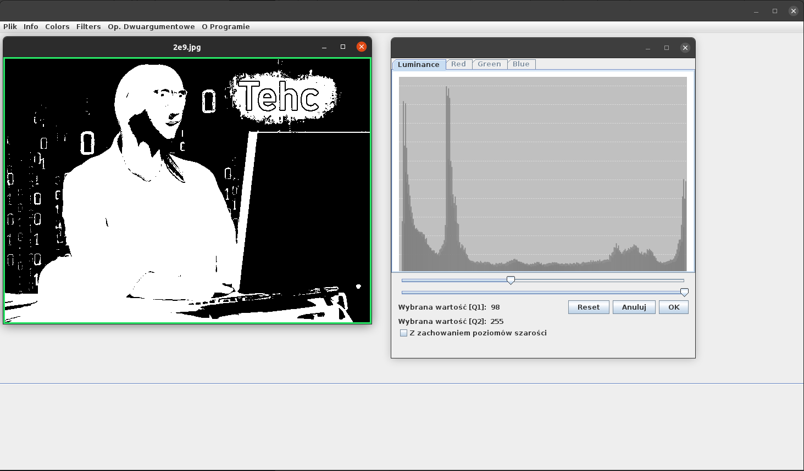
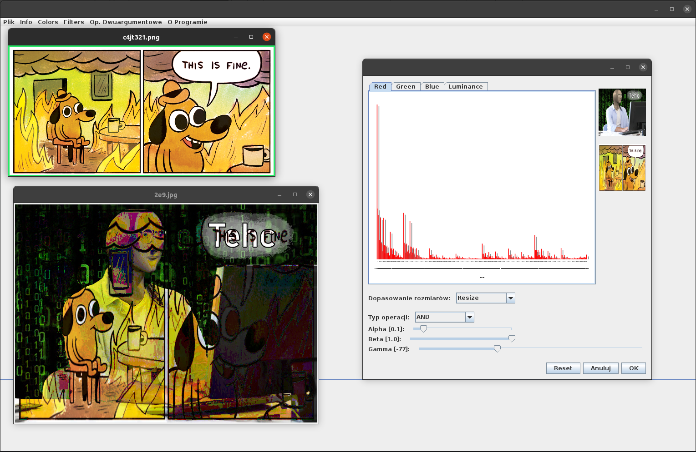

# APO_ImageProcessingApp
Image Processing App - Academic project

* Histogram
* Rozciąganie hist.
* Wyrównanie hist.
* Negacja
* Progowanie
* Posteryzacja
* Rozmywanie
    * Blur
    * Gaussian
    * Median
* Wykrywanie krawędzi
    * Sobel
    * Laplace
    * Prewitt
    * Canny
* Uniwersalna operacja punktowa
* Filtracja dwuetapowa
* Szkieletyzacja
* Operacje morfologiczne
    * Erozja
    * Dylacja
    * Otwarcie
    * Zamknięcie
* Progowanie adaptacyje
* Segmentacja przez Wododziały
* Progowanie Otsu
* Konwersja do skali szarości
* dodawanie obrazów
* operacje logiczne

